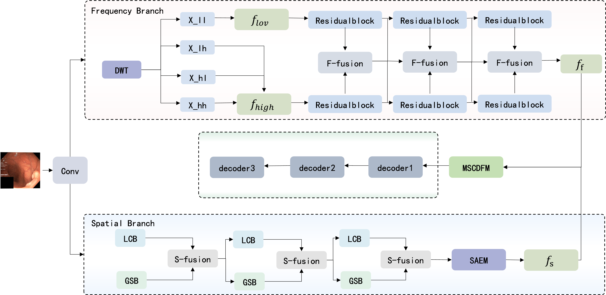

# <p align=center>`Medical Image Segmentation`</p>


:fire::fire: This is an official repository of our work on medical image segmentation.:fire::fire:

> If you have any questions about our work, feel free to contact me via e-mail (zhangdeping@stu.gpnu.edu.cn).

## Get Start
> Our experiments are based on ubuntu, and windows is not recommended.
> 
**0. Install**

```
conda create --name FSDN-MB python=3.8 -y
conda activate FSDN-MB
conda install pytorch torchvision torchaudio pytorch-cuda=11.8 -c pytorch -c nvidia
pip install -U openmim
mim install mmengine
mim install "mmcv>=2.0.0"

cd mmsegmentation
pip install -v -e .
pip install ftfy
pip install regex
pip install einops
```

The following methods can be used to verify that the experimental environment is successfully set up:
```
1. mim download mmsegmentation --config pspnet_r50-d8_4xb2-40k_cityscapes-512x1024 --dest .
2. python demo/image_demo.py demo/demo.png configs/pspnet/pspnet_r50-d8_4xb2-40k_cityscapes-512x1024.py pspnet_r50-d8_512x1024_40k_cityscapes_20200605_003338-2966598c.pth --device cuda:0 --out-file result.jpg
```
After the preceding two steps are successfully run, if the result.png file is generated under the mmsegmentation folder, the environment is successfully created.The result.png as shown in the following.

<p align="center"></p> 

**1. Dataset**
> The dataset used in the experiment can be obtained in the following methods:
- For polyp segmentation task: [Polypseg](https://github.com/DengPingFan/PraNet): including Kvasir, - CVC-ClinicDB, CVC-ColonDB, EndoScene and ETIS dataset.


**2. Experiments**
We recommend that you place the project folder in a location such as a solid state drive, and put the checkpoint files generated from the experiment on a mechanical hard drive to save space, so you can choose to create a soft connection. Specific practices are as follows:

> ln -s   "mechanical hard disk path"  /medical_seg/mmsegmentation/work_dirs

If your hardware resources are relatively rich, ignore this advice.

> **Note: Our experiment is implemented based on [mmsegmentation](https://github.com/open-mmlab/mmsegmentation). The environment configuration can also refer to the [mmsegmentation](https://github.com/open-mmlab/mmsegmentation), and questions about the entire project can refer to the [official documentation](https://mmsegmentation.readthedocs.io/zh-cn/latest/).**

## Our Work

###多分支架构的频域-空间域双域分割网络
###FSDN-MB: Frequency-Spatial Dual-Domain Network with Multi-Branch Architecture

#### **Abstract**
结直肠癌（CRC）是全球范围内导致死亡的主要癌症之一，其早期发现和治疗对于降低死亡率至关重要。结肠镜检查是检测癌前息肉的关键方法，但自动化的息肉检测在准确性和效率上存在挑战。目前，深度学习技术在医学图像分析中展现出巨大潜力，尤其是在息肉的自动化检测和分割方面。
然而，现有模型在处理全局与局部特征时存在不连续性，且多忽视频域信息，影响了分割的精度和鲁棒性。针对这些挑战，我们开发了一种创新的频域-空间域双域分割网络（FSDN-MB），该网络采用多分支架构，集成了局部-全局空间处理模块（LGSPM）和自适应特征选择模块（SAEM），以及多级多尺度跨域融合模块（MMCFM）。
FSDN-MB的设计旨在通过精确的图像分割辅助医生进行息肉的检测和诊断，提高结直肠癌筛查的准确性和效率。
在Kvasir-SEG、CVC-ClinicDB和EndoScene数据集上的测试结果表明，FSDN-MB在Dice系数、平均交并比（mIoU）、准确率（ACC）、召回率（Recall）和精确度（Precision）等关键指标上均表现优异。
这一成果不仅提升了息肉分割的性能，也为临床医生提供了一个强有力的工具，以支持更快速、更准确的诊断决策，具有显著的临床应用价值和社会效益。
#### Architecture

<p align="center">
     <br />
    <em> 
    Figure 1:本文提出的FSDN-MB网络是一个基于频域和空间域的双分支网络，随后经过多级多尺度跨域融合模块（MMCFM）,最后经过三个decoder实现息肉的完整分割。
    </em>
</p>

#### Experiments

更改数据集路径
1.下载 Polypseg 数据集，然后解压缩数据集。
2.更新项目中 /FSDN-MB/mmsegmentation/local_config/base/datasets/polypseg.py 的训练路径和测试路径，分别位于第 55、56、67 和 68 行。
建议在更新数据集路径时使用绝对路径而不是相对路径。ISIC2018、DSB2018也以上述方式更改。


训练
请确认您当前是否在 mmsegmentation 目录下。如果没有，请进入mmsegmentation目录。然后在终端中运行以下代码：

python tools/train.py /FSDN-MB/mmsegmentation/local_config/polyp/main/polyp_mscsn_t_polypseg_512*512_80k.py
python tools/train.py /FSDN-MB/mmsegmentation/local_config/polyp/main/polyp_mscan_t_synapse_512*512_50k.py
......
训练时，每8000次迭代进行一次验证，同时保存检查点文件。批量大小和验证集评估指标可以在相应的配置文件中更改。

测试
您可以在 /FSDN-MB/mmsegmentation/work_dirs 文件夹中找到与配置文件同名的目录。下面存储的是使用当前配置进行测试时生成的日志、检查点和其他文件。

测试模型的命令如下：

python tools/test.py /FSDN-MB/mmsegmentation/local_config/polyp/main/polypt_mscsn_t_polypseg_512512_80k.py /FSDN-MB/mmsegmentation/work_dirs/polyp_mscsn_t_polypseg_512512_80k/iter_80000.pth --eval mIoU
您可以替换 iter_80000.pth 来评估不同检查点的性能。同样，您可以替换 mIoU，并使用不同的评估指标来评估模型。

mmsegmentation 支持的评估指标可以在 /FSDN-MB/mmsegmentation/mmseg/evaluation/metrics 中找到。

计算翻牌和参数
请运行以下命令：

python /FSDN-MB/mmsegmentation/local_config/polyp/main/MCANet_mscsn_t_polypseg_512*512_80k.py --形状 512 512
您可以通过将“512 512”替换为您想要的图像尺寸来计算它。 您可以替换配置文件来评估不同网络的 flops 和参数。


## Acknowlegement

Thanks [mmsegmentation](https://github.com/open-mmlab/mmsegmentation) providing a friendly codebase for segmentation tasks. And our code is built based on it.


### License

Code in this repo is for non-commercial use only.
